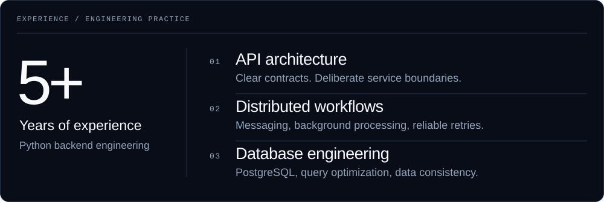
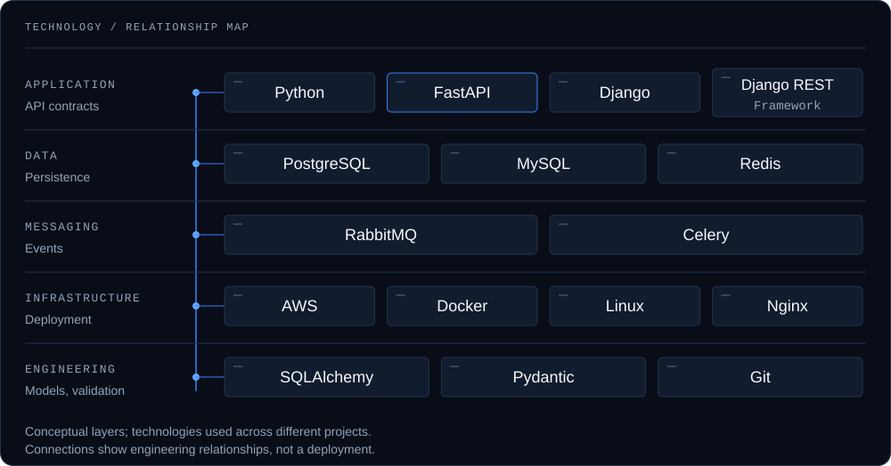
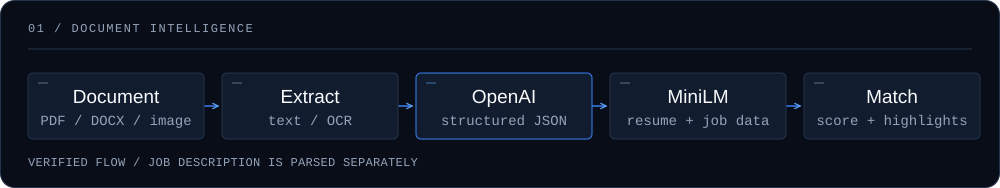
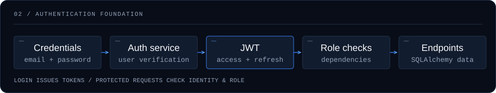
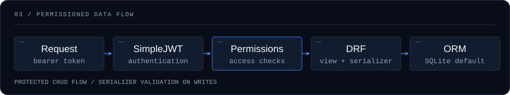
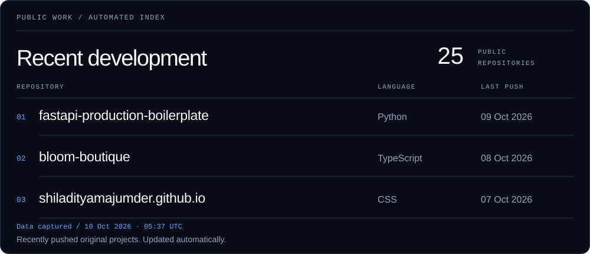

<!-- markdownlint-disable MD013 MD033 MD041 -->
<!-- Artwork: scripts/generate_assets.py. Public activity: scripts/generate_activity.py. -->

<picture>
  <source media="(max-width: 600px) and (prefers-reduced-motion: reduce)" srcset="assets/hero/hero-mobile-static.svg" />
  <source media="(prefers-reduced-motion: reduce)" srcset="assets/hero/hero-static.svg" />
  <source media="(max-width: 600px)" srcset="assets/hero/hero-mobile.svg" />
  
</picture>

**Backend engineering · Kolkata, India** &nbsp; / &nbsp; [LinkedIn](https://www.linkedin.com/in/shiladitya-majumder/) · [Medium](https://medium.com/@shiladityamajumder) · [Email](mailto:shiladityamajumder07@gmail.com)

[Identity](#01--engineering-identity) &nbsp; / &nbsp; [Ecosystem](#02--technology-ecosystem) &nbsp; / &nbsp; [Work](#03--architecture-showcase) &nbsp; / &nbsp; [Journey](#04--engineering-journey) &nbsp; / &nbsp; [Writing](#05--field-notes) &nbsp; / &nbsp; [Activity](#07--public-development)

<picture>
  <source media="(max-width: 600px)" srcset="assets/dashboard/engineering-practice-mobile.svg" />
  
</picture>

Engineering strengths, grounded in professional experience. The hero illustrates backend architecture patterns.

## 01 / Engineering identity

I build backend systems where **reliability is a product feature**: clear service boundaries, predictable failure handling, observable workflows, and database access that stays fast as traffic grows.

With **5+ years of experience** across healthcare, e-commerce, agriculture, logistics, recruitment, and AI-enabled products, I work at **SastaSundar Healthbuddy Limited** on backend systems for healthcare and commerce.

> **Build for today.** 
> **Design for growth.** 
> **Operate for reliability.**

**The work** — REST APIs, FastAPI and Django services, event-driven integrations, Celery workflows, reusable microservice foundations, and database-backed search and inventory.

**The approach** — Clear ownership, predictable contracts, dependable retries, consistency under concurrency, and performance measured under real load. Keep operations simple; let business needs justify the architecture.

## 02 / Technology ecosystem

<picture>
  <source media="(max-width: 600px)" srcset="assets/diagrams/ecosystem-mobile.svg" />
  
</picture>

Read the technology map

- **Application** — Python · FastAPI · Django · Django REST Framework
- **Data** — PostgreSQL · MySQL · Redis
- **Messaging** — RabbitMQ · Celery
- **Infrastructure** — AWS · Docker · Linux · Nginx
- **Engineering** — SQLAlchemy · Pydantic · Git

These layers connect API contracts to persistence, asynchronous work, and operations. The tools appear across different projects; the map does not describe one production deployment.

**Supporting experience:** Node.js, NestJS, Fastify, and modernization of Flask applications.

## 03 / Architecture showcase

Three public codebases. Each diagram is a simplified reading of implemented code paths.

### 01 — VisScan / AI Resume Intelligence

Extract resume text from PDF, Word documents, and images; parse resumes and job descriptions into structured data with OpenAI; compare candidates to roles using semantic similarity and skill overlap. The matching response includes a score, verdict, and highlights.

**FastAPI · OpenAI · Pydantic · OCR · SentenceTransformers**

<picture>
  <source media="(max-width: 600px)" srcset="assets/diagrams/visscan-mobile.svg" />
  
</picture>

[Explore VisScan →](https://github.com/shiladityamajumder/visscan) &nbsp; / &nbsp; [Extraction](https://github.com/shiladityamajumder/visscan/blob/main/app/utils/file_utils.py) · [Matching](https://github.com/shiladityamajumder/visscan/blob/main/app/services/relevance_checker.py)

### 02 — FastAPI Auth / Backend Foundation

A modular authentication foundation with credential verification, JWT access and refresh tokens, role-based dependencies, and SQLAlchemy persistence. Organized routers, schemas, services, and response wrappers keep API responsibilities explicit.

**FastAPI · Pydantic · SQLAlchemy · PyJWT**

<picture>
  <source media="(max-width: 600px)" srcset="assets/diagrams/fastapi-auth-mobile.svg" />
  
</picture>

[Explore FastAPI Auth →](https://github.com/shiladityamajumder/fastapi) &nbsp; / &nbsp; [Auth service](https://github.com/shiladityamajumder/fastapi/blob/main/fastapi-auth/src/auth/service.py) · [Role dependencies](https://github.com/shiladityamajumder/fastapi/blob/main/fastapi-auth/src/auth/permissions.py)

### 03 — Django REST Auth & CRUD

JWT authentication through SimpleJWT, explicit permission checks, serializer validation, and ORM-backed CRUD workflows. The repository includes customer, mechanic, and admin permission classes, with SQLite configured as the default database.

**Django · Django REST Framework · SimpleJWT · SQLite**

<picture>
  <source media="(max-width: 600px)" srcset="assets/diagrams/django-rest-auth-mobile.svg" />
  
</picture>

[Explore Django REST Auth & CRUD →](https://github.com/shiladityamajumder/django-rest-api-auth-crud) &nbsp; / &nbsp; [Permissions](https://github.com/shiladityamajumder/django-rest-api-auth-crud/blob/main/demo_project/app/permissions.py) · [CRUD views](https://github.com/shiladityamajumder/django-rest-api-auth-crud/blob/main/demo_project/service/views.py)

## 04 / Engineering journey

01 / OCTOBER 2025 — PRESENT · KOLKATA

### SastaSundar Healthbuddy Limited

**Software Engineer**

- Design and maintain FastAPI microservices for healthcare and commerce, with clear service boundaries and dependable API contracts.
- Refactor legacy Flask and FastAPI MVC systems into layered architectures; contribute to API gateway modernization from Express to Fastify.
- Implement RabbitMQ communication and Celery/Redis background workflows.
- Improve API responsiveness through PostgreSQL query optimization and indexing.

│ &nbsp; SERVICE MODERNIZATION / DISTRIBUTED WORKFLOWS / DATABASE PERFORMANCE

02 / AUGUST 2021 — OCTOBER 2025 · REMOTE

### Centrelocus — ESROT Consulting Labs

**Python Developer**

- Built Django REST Framework and FastAPI products across healthcare, commerce, agriculture, logistics, recruitment, and AI-enabled services.
- Developed AI-assisted resume parsing with OpenAI, OCR, and semantic search.
- Implemented geolocation, real-time tracking, and asynchronous workflows; worked with secure healthcare DICOM processing systems.
- Deployed containerized applications on AWS and collaborated across product teams.

## 05 / Field notes

Practical backend engineering: design choices, operational trade-offs, and the failure modes that matter after software reaches production.

### Architecture & system design

01 / PROJECT STRUCTURE 
**[Clean Architecture in Django: A Practical Real-World Project Structure](https://shiladityamajumder.medium.com/clean-architecture-in-django-a-practical-real-world-project-structure-1f4c89e402f0)**

02 / SYSTEM GROWTH 
**[Designing Software That Survives Growth](https://shiladityamajumder.medium.com/designing-software-that-survives-growth-planning-architecture-and-team-scaling-done-right-a4dd127f0d5a)**

03 / BACKEND DESIGN 
**[Django vs FastAPI vs Node/Express vs NestJS](https://shiladityamajumder.medium.com/django-vs-fastapi-vs-node-express-vs-nestjs-structuring-real-world-backend-projects-the-right-way-497dbb73e201)**

04 / MODERNIZATION 
**[Migrating a Legacy Django REST API to FastAPI](https://shiladityamajumder.medium.com/migrating-a-legacy-django-rest-api-to-fastapi-step-by-step-refactor-strategy-a24258e73b16)**

### APIs & distributed systems

05 / ASYNCHRONOUS APIS 
**[Async APIs with FastAPI: Patterns, Pitfalls, and Best Practices](https://shiladityamajumder.medium.com/async-apis-with-fastapi-patterns-pitfalls-best-practices-2d72b2b66f25)**

06 / DATABASE PERFORMANCE 
**[Optimizing Django ORM Queries for Performance](https://shiladityamajumder.medium.com/optimizing-django-orm-queries-for-performance-tips-tricks-32d3d9dfee33)**

07 / API CONTRACTS 
**[Pydantic and FastAPI: Data Validation Done Right](https://shiladityamajumder.medium.com/pydantic-and-fastapi-data-validation-done-right-b44287cfd019)**

08 / MESSAGING 
**[Building Event-Driven Microservices: RabbitMQ vs Kafka](https://shiladityamajumder.medium.com/building-event-driven-microservices-with-python-rabbitmq-vs-kafka-explained-simply-d61cfff7ae46)**

[Read the complete publication →](https://medium.com/@shiladityamajumder)

## 06 / Foundations

**Master of Computer Applications** — Integral University, Lucknow · Expected 2027 
**Bachelor of Science** — University of Calcutta · 2016

Certifications & continued learning

- Applied AI and Machine Learning — Applied AI Course
- Multi-Agent Systems — DeepLearning.AI
- AWS Machine Learning — Coursera
- Neural Networks and Deep Learning — Coursera

## 07 / Public development

<picture>
  <source media="(max-width: 600px)" srcset="assets/activity/activity-mobile.svg" />
  
</picture>

<!-- activity-links:start -->

[fastapi-production-boilerplate](https://github.com/shiladityamajumder/fastapi-production-boilerplate) · [bloom-boutique](https://github.com/shiladityamajumder/bloom-boutique) · [shiladityamajumder.github.io](https://github.com/shiladityamajumder/shiladityamajumder.github.io)

<!-- activity-links:end -->

[Browse all public repositories →](https://github.com/shiladityamajumder?tab=repositories)

Updated automatically from public GitHub data. The capture date is shown in the artwork; repository push dates can include collaborator activity.

## 08 / Lab notes

<picture>
  <source media="(max-width: 600px) and (prefers-reduced-motion: reduce)" srcset="assets/terminal/lab-notes-mobile-static.svg" />
  <source media="(prefers-reduced-motion: reduce)" srcset="assets/terminal/lab-notes-static.svg" />
  <source media="(max-width: 600px)" srcset="assets/terminal/lab-notes-mobile.svg" />
  
</picture>

 

<picture>
  <source media="(max-width: 600px)" srcset="assets/footer/footer-mobile.svg" />
  
</picture>

Working on Python backend systems, distributed workflows, healthcare technology, API performance, or open-source foundations? I would be glad to exchange ideas.

**[GitHub](https://github.com/shiladityamajumder)** &nbsp; / &nbsp; **[LinkedIn](https://www.linkedin.com/in/shiladitya-majumder/)** &nbsp; / &nbsp; **[Medium](https://medium.com/@shiladityamajumder)** &nbsp; / &nbsp; **[Email](mailto:shiladityamajumder07@gmail.com)**
